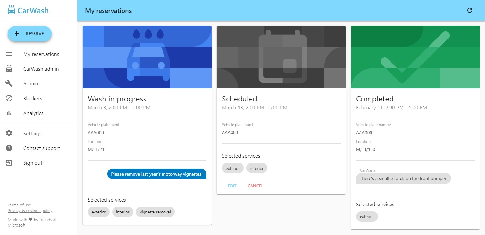
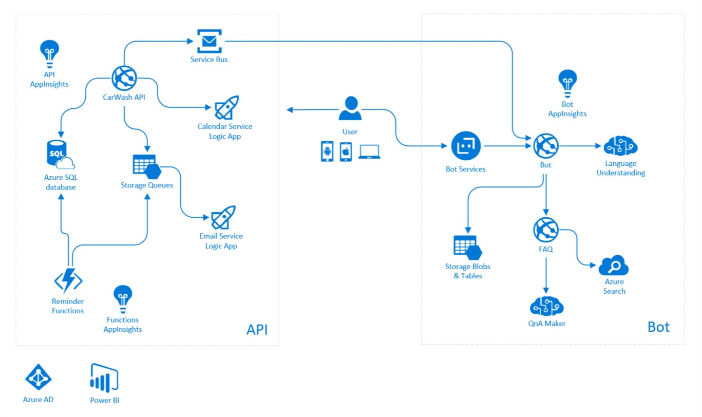

# CarWash app

   

The CarWash app is a demo app running in production, demonstrating Microsoft Hungary's digital transformation and the benefits of using Azure platform services.

## Features

- Cross-platform PWA
- Cross-company (multi-tenant)
- Company SSO (Microsoft Entra ID)
- Reminders using either push notification or email
- Calendar integration using meeting requests
- Reservation management for company admins
- Backlog dashboard for car wash vendor
- GDPR compliance features
- **Intelligent bot in Microsoft Teams**
- and a lot more...

## Architecture

The project is implemented to utilize only Azure PaaS (platform-as-a-service) services including serverless Azure Functions and Logic Apps, App Services, Cognitive Services, Power BI reports etc.

## Projects

- `CarWash.ClassLibrary` Reusable class library targeting .NET Standard
- `CarWash.Functions` Azure functions app for proactive communication (eg. reminders)
- `CarWash.PWA` ASP.NET Core 2.1 API & React frontent (Progressiove Web App)
- `CarWash.PWA.Windows` PWA wrapper for the Microsoft Store
- `CarWash.PWA.iOS` PWA wrapper for the Apple App Store
- `CarWash.PWA.Tests` API unit tests
- `CarWash.PWA.UiTests` Selenium UI tests
- `CarWash.Bot` Chat-bot using Microsoft Bot Framework

## Contributors

- [Mark Szabo](mailto:a-marks@microsoft.com)
- Jozsef Vadkerti
- Akos Szego
- Tamas Veiland
- Gabor Kulcsar
- Linda Billinger

## Contributing

If you'd like to contribute to this sample, see [CONTRIBUTING.MD](/CONTRIBUTING.md).

This project has adopted the [Microsoft Open Source Code of Conduct](https://opensource.microsoft.com/codeofconduct/). For more information see the [Code of Conduct FAQ](https://opensource.microsoft.com/codeofconduct/faq/) or contact [opencode@microsoft.com](mailto:opencode@microsoft.com) with any additional questions or comments.

## Copyright

Copyright (c) 2018-25 EU Motorsport Service Kft. All rights reserved.
